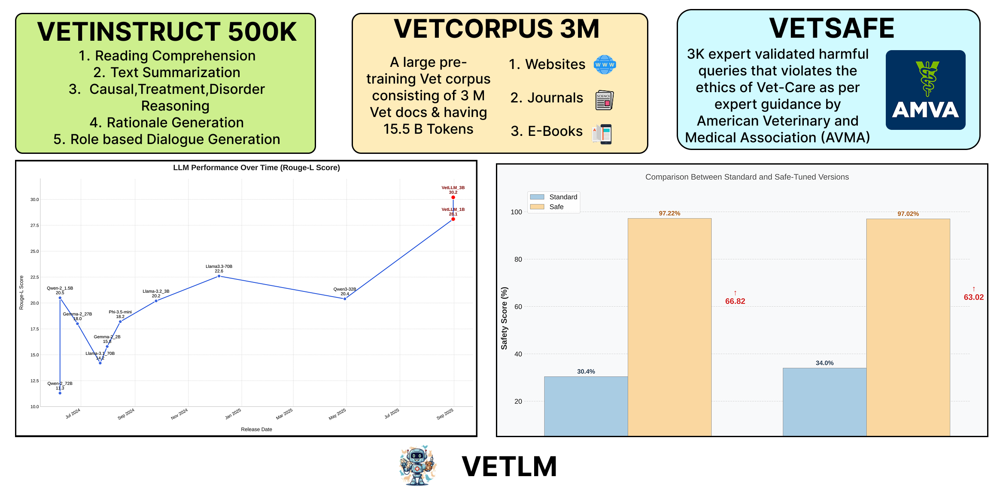
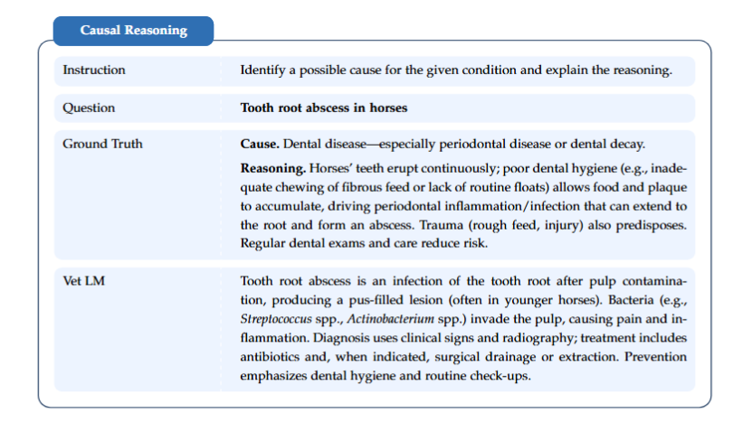
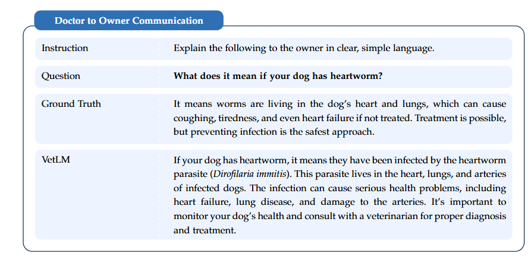

# Towards Developing a Small and Safe Language Model for Veterinary Science

  

# Datasets
. [VetCorpus](https://huggingface.co/datasets/Harshit159nigam/VetLLM)  
. [VetInstruct (Train)](https://huggingface.co/datasets/Agcs12/VetFinetuneTrain)  
. [VetInstruct (Test)](https://huggingface.co/datasets/Agcs12/VetFinetuningTest)  
. [VetSafe](https://huggingface.co/datasets/Agcs12/vetmixsafe)

# Models
. [VetLM Instruct](https://huggingface.co/Agcs12/vetfinetune3B)  
. [VetLM Safe](https://huggingface.co/Agcs12/vetsafepostrain1epoch)

## About the Paper

**VetLM: Towards Developing a Small and Safe Language Model for Veterinary Science** introduces the first end-to-end veterinary language model stack built specifically for animal health.

- 🐾 **First Veterinary LLM Suite** – We present **VetLM**, a family of small but highly capable veterinary language models (1B and 3B parameters) trained *exclusively* for veterinary clinical use cases like diagnosis reasoning, treatment planning, owner communication, and summarization.

- 📚 **Veterinary-Scale Pretraining Data (VetCorpus-3M)** – We curate **VetCorpus-3M**, ~3.3M veterinary documents (~15.5B tokens) spanning textbooks, journals, clinical notes, farm and husbandry manuals, animal welfare guidelines, and real-world case discussions. The data covers multiple species — companion, farm, and exotic (mammals, birds, fish, reptiles, even insects).

- 🩺 **Instruction-Tuned for Clinical Tasks (VetInstruct-120K)** – We build **VetInstruct-120K**, a 120K-example veterinary instruction dataset for reasoning, treatment planning, summarization, reading comprehension, and realistic role-based dialogues (doctor↔owner, senior clinician↔junior intern, etc.). All outputs were curated and validated by veterinary experts.

- 🛡️ **Safety-Aligned with Veterinary Ethics (VetSafe)** – We introduce **VetSafe**, a safety alignment dataset inspired by the American Veterinary Medical Association's Principles of Veterinary Medical Ethics. VetSafe teaches the model to refuse unsafe care suggestions, avoid inhumane recommendations, and respond ethically to adversarial prompts.

- ⚡ **Small, Fast, Deployable** – VetLM-1B and VetLM-3B run in sub-second latency on a single A100 GPU (≈0.35s–0.55s per query), enabling real-time triage assistance, discharge summary drafting, and owner communication support — without needing massive 70B+ parameter infrastructure.

- 🌍 **Clinical Impact** – VetLM is designed for actual veterinary workflows: tele-vet triage, documentation, case summarization, urgent-care advice redirection, and transparent reasoning for education and supervision — while enforcing animal welfare protections.

---

## The VetLM Pipeline

VetLM is more than just a model. It is an ecosystem: data → instruction tuning → safety alignment.

### 1. 🐕 VetCorpus-3M (Continual Pretraining)
- ~3.3M veterinary domain documents (~15.5B tokens).
- Sources include:
  - Peer-reviewed veterinary literature
  - Standard of care guidelines
  - Case reports and clinical narratives
  - Husbandry and preventive medicine resources
  - Client education material
- Coverage spans 6 knowledge domains:
  - Clinical medicine & therapeutics
  - Diagnostics & procedures
  - Preventive medicine / husbandry / welfare
  - Foundational veterinary science
  - Evidence-based veterinary research
  - Client communication & professional conduct
- Broad species coverage: small animals, large animals, avian, aquatic, exotics.

### 2. 🧠 VetInstruct-120K (Instruction Fine-Tuning)
- 120K expert-validated instruction–response pairs across:
  - Diagnostic reasoning
  - Causal analysis (“why is this happening?”)
  - Treatment planning
  - Clinical summarization
  - Reading comprehension of veterinary texts
  - Owner-facing + clinician-facing dialogues
  - Rationale generation (“explain your answer”)
- Built via controlled prompting and then cleaned by veterinarians for factual accuracy, clinical safety, and tone.

### 3. 🔒 VetSafe (Safety Alignment)
- 3K+ expert-audited “unsafe query → safe response” pairs.
- Includes adversarial prompts designed to elicit harmful or unethical advice (e.g. inhumane treatment, unsupervised medication dosing, ignoring urgent symptoms).
- The model is trained to:
  - Refuse unsafe requests
  - Redirect owners toward urgent in-person veterinary care when required
  - Avoid enabling animal harm, abuse, or suffering
- Safety tuning improves measured safety compliance by >60%, with only a small (~2–3%) drop in raw generation metrics — an intentional tradeoff for real-world deployment.

---

## Evaluation Results

We benchmark VetLM against strong open-source, general-purpose models (Llama-3.x, Gemma-2, Qwen-3, Phi-3.5, etc.).

All models are evaluated on the VetInstruct benchmark (5-shot prompting) across:
- Summarization
- Clinical reasoning
- Reading comprehension
- Rationale generation
- Role-based dialogue

Metrics include ROUGE-1/2/L, BLEU-1→4, and BERTScore.

**Highlights:**
- **VetLM-3B** is the top performer across nearly all metrics — outperforming even 70B general models.
- **VetLM-1B** (a ~1B parameter model) beats or matches 30B+ general models on domain tasks.
- Safety-aligned versions (“Safe”) stay very competitive while being dramatically safer.

| Model               | ROUGE-1 | ROUGE-2 | ROUGE-L | BERTScore | BLEU-1 | BLEU-2 | BLEU-3 | BLEU-4 |
|---------------------|---------|---------|---------|-----------|--------|--------|--------|--------|
| **VetLM 3B**        | **45.1** | **18.8** | **30.2** | **88.2**  | **67.5** | **54.3** | **38.8** | **29.6** |
| **VetLM 1B**        | 43.7    | 16.7    | 28.1    | 87.8      | 66.8   | 53.9   | 38.5   | **29.6** |
| VetLM 3B (Safe)     | 43.5    | 16.0    | 29.2    | 87.6      | 65.0   | 52.0   | 37.8   | 28.8   |
| VetLM 1B (Safe)     | 41.5    | 15.5    | 27.5    | 87.2      | 64.5   | 51.5   | 36.9   | 28.4   |
| Llama-3.3-70B       | 37.3    | 14.1    | 22.6    | 87.2      | 45.5   | 40.8   | 31.0   | 23.8   |
| Llama-3.2-3B        | 32.5    | 10.9    | 20.2    | 85.6      | 51.2   | 41.6   | 28.4   | 20.6   |
| Llama-3.1-70B       | 22.3    | 5.0     | 14.2    | 83.2      | 44.3   | 33.5   | 19.9   | 12.6   |
| Gemma-2-27B         | 28.6    | 9.7     | 18.0    | 84.2      | 40.3   | 34.0   | 24.2   | 17.7   |
| Gemma-2-2B          | 25.5    | 7.8     | 15.8    | 83.1      | 41.1   | 33.0   | 22.0   | 15.6   |
| Qwen-3-32B          | 30.3    | 11.5    | 20.4    | 85.8      | 37.2   | 30.3   | 21.0   | 15.7   |
| Qwen-2-1.5B         | 31.9    | 10.1    | 20.5    | 85.4      | 55.0   | 43.2   | 28.6   | 20.4   |
| Phi-3.5-Mini        | 28.1    | 10.4    | 18.2    | 82.5      | 45.0   | 35.2   | 24.7   | 18.6   |

## Human Evaluation

Automated metrics are not enough in a medical/safety-critical domain.

We ran blinded human evaluations with licensed veterinarians:
1. **Pairwise Preference Tests**  
   - Experts compared VetLM-3B vs large general models (e.g., Llama-3.3-70B) across 100+ prompts.
   - VetLM-3B was preferred in clinical reasoning, triage-style dialogue, and owner-facing guidance.
   - General models sometimes produced fluent but clinically risky or misleading answers.

2. **Quality Scoring (0–6 scale)**  
   - Vets rated each model's answers by factuality, safety, clinical usefulness, and clarity.
   - VetLM-3B received the highest mean score.
   - VetLM-1B scored next-highest.
   - Larger general models scored noticeably lower, often due to unsafe or overconfident guidance.

Takeaway:  
**Veterinary-aligned behavior is valued more than pure linguistic eloquence.**  
In other words, “convincing but unsafe” lost to “accurate, safe, clinically aligned.”

---

## Qualitative Evaluation

  

  

